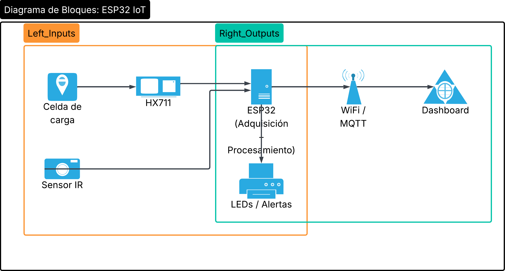

# SMIC_2610_Guzman_Torres
En este repositorio encontrará todo lo relacionado al proyecto de SMIC el cual se llamará STOCKLY realizado por los estudiantes Jerson Nicolás Guzmán Muñoz Y Giovanny Alejandro Torres Villarraga.

El nombre Stockly surge de la palabra ‘stock’, que representa el inventario, combinada con el sufijo ‘-ly’, común en plataformas tecnológicas. El nombre refleja un sistema moderno orientado a la gestión inteligente de inventario en tiempo real.

 # Descripción del proyecto:
En supermercados y tiendas de autoservicio, la disponibilidad de productos en exhibición influye directamente en la experiencia del cliente y en la posibilidad de concretar ventas. Cuando una góndola presenta niveles bajos de inventario y no se detecta a tiempo, se generan pérdidas por desabastecimiento, retrasos en reposición y baja eficiencia operativa. 

Con el fin de aportar una solución, se propone el desarrollo de una góndola inteligente basada en ESP32. El sistema adquiere información mediante una celda de carga y un sensor infrarrojo, procesa los datos localmente y los envía por WiFi a una interfaz de monitoreo. De esta manera, el microcontrolador no solo mide variables, sino que integra sensado, procesamiento digital, toma de decisiones y comunicación IoT.

# Diagrama 
Se anexa imagen del diagrama de bloques inicial para el desarrollo del proyecto

El objetivo de implementar esto es: 
- Integrar una celda de carga con módulo HX711 para medir el peso total de los productos.
- Implementar un sensor infrarrojo para detectar eventos de interacción o retiro de productos.
- Programar el ESP32 para adquirir, procesar y transmitir datos por WiFi.
- Estimar la cantidad de productos disponibles a partir del peso total medido.
- Generar alertas de stock bajo y prioridad de reposición.
- Visualizar variables y KPIs en un dashboard remoto

# Librerías utilizadas

## HX711

# Funciones implementadas

## setup()

La función `setup()` se ejecuta una sola vez al iniciar el ESP32. Su propósito es preparar todos los elementos del sistema antes de que empiece la ejecución principal.

En esta función se inicializa la comunicación serial a 115200 baudios, lo cual permite visualizar datos en el monitor serial. También se configuran los pines del sensor infrarrojo, el LED de estado, los motores DC y los sensores ultrasónicos.

Además, se inicializa el módulo HX711 mediante la instrucción `scale.begin(DOUT_PIN, SCK_PIN)`, se aplica el factor de calibración con `scale.set_scale(CALIBRACION)` y se realiza la tara inicial con `scale.tare()`. Esta tara permite que el sistema tome como cero el peso inicial de la góndola.

## obtenerDistancia(int i)

La función `obtenerDistancia(int i)` se encarga de medir la distancia detectada por uno de los sensores ultrasónicos del sistema.

El parámetro `i` indica cuál sensor ultrasónico se desea utilizar. Para realizar la medición, la función envía un pulso corto por el pin `TRIG` correspondiente y luego mide el tiempo que tarda en recibirse la señal de regreso por el pin `ECHO`.

Con ese tiempo se calcula la distancia usando la expresión `pulseIn(ECHOS[i], HIGH) * 0.034 / 2`. El valor `0.034` corresponde aproximadamente a la velocidad del sonido en centímetros por microsegundo. Se divide entre dos porque la señal viaja desde el sensor hasta el objeto y luego regresa.

Esta función permite identificar si hay producto cerca de la salida de cada banda transportadora.

## controlarMotor(int id, bool encender)

La función `controlarMotor(int id, bool encender)` permite controlar los motores DC conectados al puente H.

El parámetro `id` indica cuál motor se desea controlar. En el código actual, el motor 0 corresponde al primer motor, el motor 1 al segundo y el motor 2 al tercero.

El parámetro `encender` define si el motor debe activarse o detenerse. Cuando `encender` es verdadero, el motor gira hacia adelante colocando un pin en estado alto y el otro en estado bajo. Cuando `encender` es falso, ambos pines se colocan en estado bajo, deteniendo el motor.

Esta función simplifica el control de los motores, ya que evita repetir las instrucciones de encendido y apagado para cada motor.

## moverBanda(int id)

La función `moverBanda(int id)` se encarga de activar una banda transportadora específica cuando se necesita reponer producto hacia el frente de la góndola.

Primero, la función guarda el tiempo inicial usando `millis()`. Luego, mientras la distancia medida por el sensor ultrasónico sea mayor que el umbral definido en `DIST_UMBRAL`, el motor correspondiente permanece encendido.

Cuando el sensor detecta que el producto ya está dentro de la distancia mínima establecida, el motor se detiene. También se incluye una condición de seguridad usando `MAX_TIME`, la cual evita que el motor quede girando indefinidamente si el sensor no detecta producto o si ocurre algún error en la lectura.

Esta función es importante porque permite automatizar el movimiento de las bandas sin mantener los motores encendidos todo el tiempo.

## loop()

La función `loop()` contiene la lógica principal del sistema y se ejecuta de forma repetitiva mientras el ESP32 esté encendido.

En primer lugar, se obtiene el peso medido por la celda de carga mediante `scale.get_units(5)`. Luego, el sistema estima el número de productos disponibles dividiendo el peso total entre el peso unitario definido en `PESO_UNITARIO`.

Después, se lee el estado del sensor infrarrojo para determinar si hay una persona interactuando con la góndola. Si el stock estimado es menor que 6 y no se detecta interacción, el sistema revisa cada una de las bandas mediante los sensores ultrasónicos.

Si alguna banda presenta una distancia mayor al umbral definido, se activa la función `moverBanda(i)` para desplazar productos hacia el frente. Finalmente, se controla el LED de estado, el cual se enciende cuando el stock es menor o igual a 2, indicando una alerta visual de stock bajo.

También se imprimen en el monitor serial los valores de peso y stock estimado, lo cual permite revisar el comportamiento del sistema durante las pruebas.

